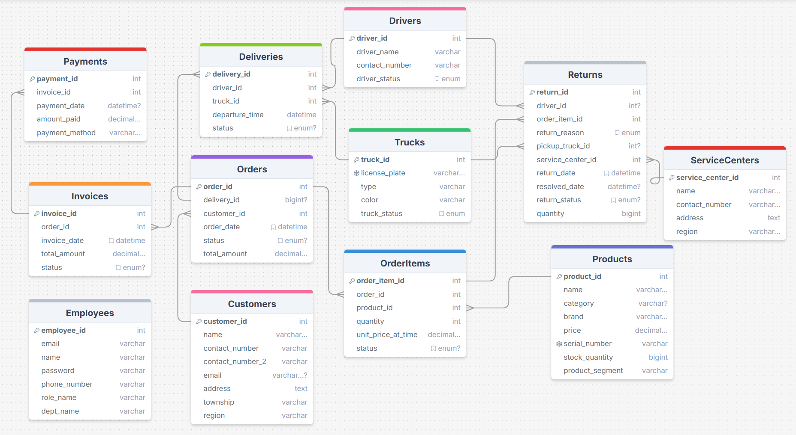

# MyanTech ERP API

This document provides instructions on how to set up the development environment for the MyanTech ERP API.

## Prerequisites

Before you begin, ensure you have the following installed on your machine:

- [Node.js](https://nodejs.org/) (version 14.x or later)
- [MySQL](https://www.mysql.com/) (version 5.7 or later)

## Installation

1. **Clone the repository**:
    ```sh
    git clone https://github.com/farout101/Backend_MyanTech/api.git
    cd api
    ```

2. **Install dependencies**:
    ```sh
    npm install
    ```

3. **Set up the MySQL database**:
    - Create a new MySQL database.
    - Update the database connection details in `db.js`:
      ```js
      require('dotenv').config();
      const mysql = require('mysql2/promise');

      const pool = mysql.createPool({
        host: process.env.DB_HOST,
        user: process.env.DB_USER,
        password: process.env.DB_PASS,
        database: process.env.DB_NAME,
        port: process.env.DB_PORT || 3306,
        waitForConnections: true,
        connectionLimit: 10,
        queueLimit: 0,
      });

      module.exports = pool;
      ```

4. **Create a `.env` file** in the root directory and add your database credentials:
    ```env
    DB_HOST=localhost
    DB_USER=your-username
    DB_PASS=your-password
    DB_NAME=your-database
    JWT_SECRET=your-jwt-secret
    PORT=4000
    ```

5. **Run database migrations**:
    - If you have any migration scripts, run them to set up the database schema.

6. **Seed the database**:
    - Run the seed script to populate the database with initial data:
      ```sh
      npm run seed
      ```

## Development

To start the development server, run:
```sh
npm run dev
```

## API Endpoints

### Authentication
- **POST /auth/login**: Login a user
- **POST /auth/logout**: Logout a user

### Users
- **GET /api/users**: Get all users with pagination
- **GET /api/users/searchUser**: Get a user by name
- **POST /api/users**: Create a new user
- **PUT /api/users/:id**: Update a user by ID

### Customers
- **GET /api/customers**: Get all customers with pagination
- **GET /api/customers/search**: Get a customer by name
- **POST /api/customers**: Create a new customer
- **PUT /api/customers**: Update a customer
- **DELETE /api/customers**: Delete a customer

### Products
- **GET /api/products**: Get all products with pagination
- **GET /api/products/search**: Search products
- **GET /api/products/brand-names**: Get all brand names
- **GET /api/products/:id**: Get a product by ID
- **POST /api/products**: Add a new product
- **PUT /api/products/:id**: Update a product by ID
- **DELETE /api/products/:id**: Delete a product by ID

### Orders
- **GET /api/orders/yearly-breakup**: Get yearly breakup of orders
- **GET /api/orders/current-year-breakup**: Get current year's breakup of orders
- **GET /api/orders/monthly-earnings/:year**: Get monthly earnings for a specific year
- **GET /api/orders/warehouse**: Get all orders for warehouse with pagination
- **GET /api/orders/sale**: Get all orders for sale with pagination
- **GET /api/orders/pendings**: View pending orders with pagination
- **GET /api/orders/:id**: Get an order by ID
- **PUT /api/orders/:id**: Update an order by ID
- **DELETE /api/orders/:id**: Delete an order by ID
- **POST /api/orders**: Add products to an order

### Deliveries
- **GET /api/deliveries**: Get all deliveries with pagination
- **GET /api/deliveries/:id**: Get a delivery by ID
- **POST /api/deliveries**: Create a new delivery
- **PUT /api/deliveries/:id**: Update a delivery by ID
- **PUT /api/deliveries/update/:delivery_id**: Update delivery status
- **DELETE /api/deliveries/:id**: Delete a delivery by ID
- **GET /api/deliveries/delivery-count**: Get delivery count

### Returns
- **GET /api/returns**: Get all returns with pagination
- **GET /api/returns/joined**: Get all returns with joined tables
- **POST /api/returns**: Create a new return
- **PUT /api/returns/assign-service-center**: Assign a service center to a return
- **PUT /api/returns/assign-transportation**: Assign transportation to a return
- **PUT /api/returns/free-driver-and-update-status**: Free driver and update return status
- **PUT /api/returns/resolve**: Resolve a return

### Drivers
- **GET /api/drivers**: Get all drivers with pagination
- **GET /api/drivers/available**: Get available drivers
- **GET /api/drivers/search**: Get a driver by name
- **POST /api/drivers**: Create a new driver
- **PUT /api/drivers**: Update a driver
- **DELETE /api/drivers**: Delete a driver
- **GET /api/drivers/available-tanglement**: Get available drivers based on delivery status

### Trucks
- **GET /api/trucks**: Get available trucks
- **GET /api/trucks/all**: Get all trucks with pagination
- **GET /api/trucks/search**: Get a truck by license plate
- **POST /api/trucks**: Create a new truck
- **PUT /api/trucks**: Update a truck
- **DELETE /api/trucks**: Delete a truck

### Invoices
- **GET /api/invoices**: Get all invoices
- **POST /api/invoices/:order_id**: Create a new invoice
- **PUT /api/invoices/status**: Change invoice status

### Service Centers
- **GET /api/serviceCenter**: Get all service centers with pagination

### Reports
- **GET /api/report/profitproduct**: Get most profitable products
- **GET /api/report/slowproduct**: Get slow-moving products
- **GET /api/report/getThisMonthSaleReport**: Get sales for the current month
- **GET /api/report/stats**: Show statistics

### Tactical Nuke
- **DELETE /tacticalNuke/tactical/Nuke/incomming/doNotUseCarelessly**: Delete all data and reset statuses

### Sample
- **GET /**: Sample route showing available endpoints

## Database Design



## Testing

To run tests, use:
```sh
npm test
```

## Linting

To lint the code, use:
```sh
npm run lint
```
#